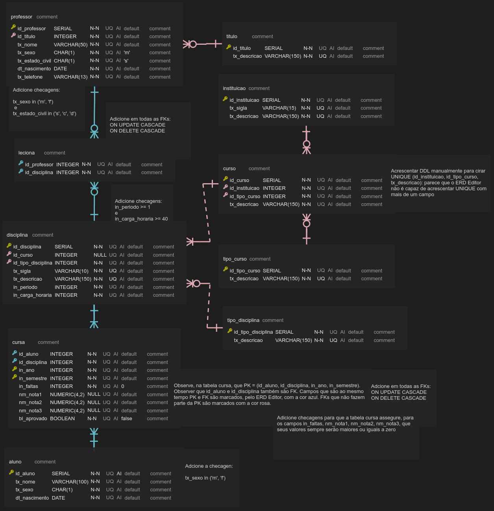
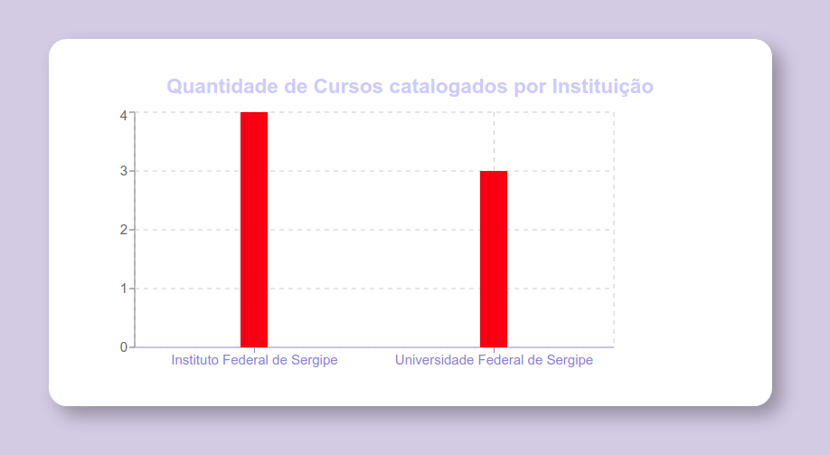
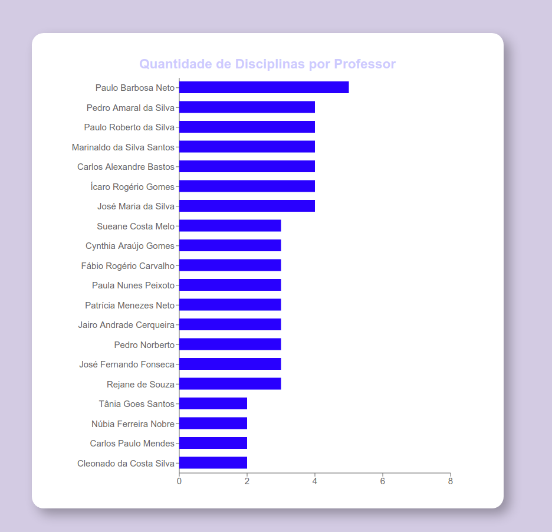
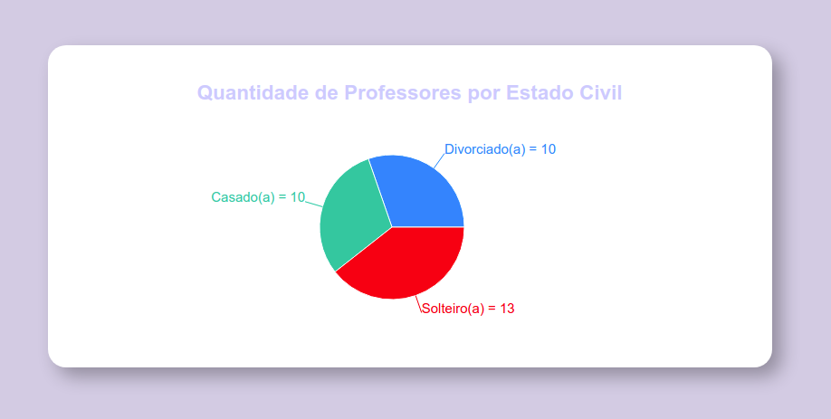
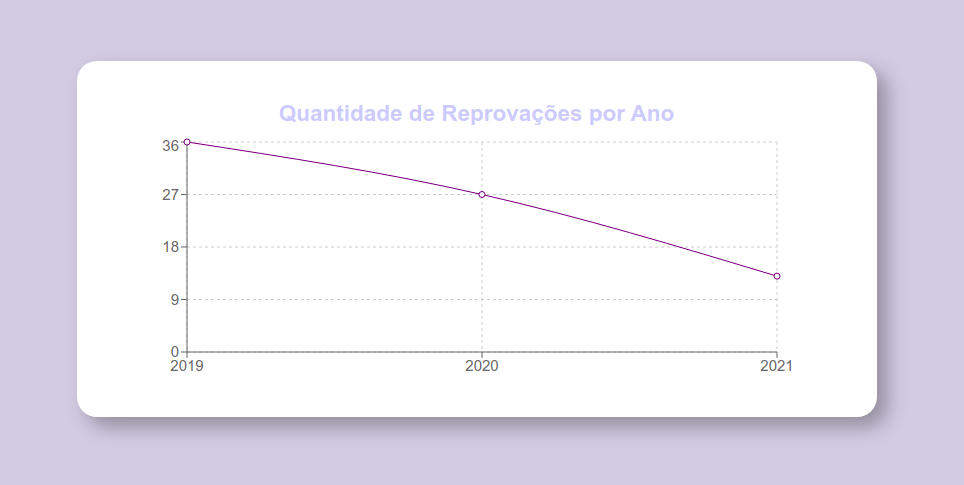

# Exercício acerca da API recharts

Esse exercício deve considerar o clone do código público disponibilizado no repositório [alexpaulooliveira/reactjs_exerc__recharts___start_point](https://github.com/alexpaulooliveira/reactjs_exerc__recharts___start_point) como ponto de partida. 

### Como baixar, configurar, e executar a aplicação:

Estando na pasta à partir da qual você deseja que a aplicação seja criada, execute o seguinte comando:

```
git clone <endereço do repositório>
```

Depois, instale as bibliotecas listadas no package.json, fazendo uso do seguinte comando:

```
npm install
```

Por fim, execute a aplicação fazendo uso do seguinte comando:


```
npm start
```

## Objetivos do exercício:

### 1) Ajustar o *backend* (*API REST*) para fornecer os dados que alimentarão todos os gráficos deste exercício.

Considere o ERD visto na imagem abaixo para programar a API REST que disponibilizará os dados necessários para os gráficos:



### 2) Criação do gráfico "Quantidade de Cursos catalogados por Instituição"

Elabore um gráfico que faça a carga dos dados via REST API, e que seja, ao máximo, similar ao que pode ser visto na imagem abaixo:




### 3) Criação do gráfico "Quantidade de Disciplinas por Professor"

Elabore um gráfico que faça a carga dos dados via REST API, e que seja, ao máximo, similar ao que pode ser visto na imagem abaixo:




### 4) Criação do gráfico "Quantidade de Professores por Estado Civil"

Elabore um gráfico que faça a carga dos dados via REST API, e que seja, ao máximo, similar ao que pode ser visto na imagem abaixo:




### 5) Criação do gráfico "Quantidade de Reprovações por Ano"

Elabore um gráfico que faça a carga dos dados via REST API, e que seja, ao máximo, similar ao que pode ser visto na imagem abaixo:




**OBS: Sugiro que o aluno navegue pelos exemplos da biblioteca recharts e estude os outros tipos de gráfico!**